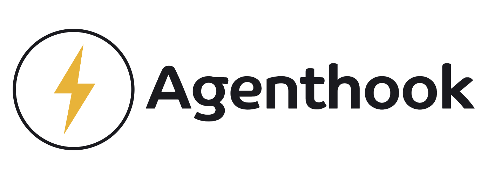

<p align="center">
  <picture>
    <source media="(prefers-color-scheme: dark)" srcset="assets/brand/agenthook-lockup-solid-dark.png">
    <source media="(prefers-color-scheme: light)" srcset="assets/brand/agenthook-lockup-solid-light.png">
    
  </picture>
</p>

> Self-hosted CLI to run **agentic coding CLIs** (Claude Code, OpenAI Codex, Gemini CLI,
> Aider, …) in **headless** mode, triggered by **webhooks**, inside isolated Docker
> containers — one reusable "instance" per repository.

agenthook is an open-source, self-hosted task runner for AI coding agents. You register a
repository as an **instance**, point your application at its webhook, and every POST runs the
configured engine against that repo. Not every job edits code — a job can also just
**analyze** an interaction, **read a database** through encrypted env vars, or **open a PR**.

The full design and rationale live in [`DESIGN.md`](./DESIGN.md) (32 sections).

## Highlights

- **Multi-engine** via adapters — Claude Code is the reference engine; Codex/Gemini/Aider ship too.
- **Deliverables** orthogonal to execution mode: `analysis` / `action` / `patch` / `commit` / `pr`.
- **Sessions** keyed by `thread_key` — a support ticket or kanban card keeps context across POSTs.
- **Encrypted secrets** per instance (immutable Fernet key), pluggable secret backends.
- **Verification loop** (self-heal) gating PRs on your tests/lint, with cost & iteration caps.
- **Human-in-the-loop** plan approval via signed URLs + a Slack reference connector.
- **Live token streaming** — engine output streams over SSE (`event: text`) to the HTTP
  stream, the chat REPL, and the TUI, so you watch a job think in real time.
- **Interactive chat** (`agenthook enter`) — a multi-turn REPL against an instance, with
  per-turn streaming, a live elapsed timer, real Ctrl+C cancel, ↑/↓ input history, and
  resume of a previous conversation by `thread_key`.
- **Isolated shell & login** — drop into the instance's sandbox container (`shell`) or log a
  subscription account into the instance's **own** auth dir (`login`); the host's `~/.claude`
  is never touched.
- **Management API** — a control-plane under `/admin/*` (bearer token + loopback by default)
  to do over HTTP everything the CLI does: instance CRUD & config, encrypted env vars
  (masked), webhook auth, verify, MCP, CLAUDE.md context, request templates, **guardrails**
  and **skills**, plus global config and read-only jobs/sessions/usage/audit. OpenAPI at `/docs`.
- **Background daemon** — `serve -d` runs the webhook server detached (pidfile + log), with
  `--stop`, `--status`, and `--logs`; or generate a systemd unit with `install-service`.
- **Operator guardrail** (on by default, every run) — a system prompt that refuses to leak
  config/secrets/credentials/identities, resists prompt-injection, and blocks mass-destructive
  database ops (DELETE/UPDATE without WHERE, DROP, TRUNCATE) and bulk dumps.
- **Usage/cost auditing**, a normalized **error taxonomy** with a per-instance **circuit breaker**,
  durable **delivery guarantees** (persist-before-ack, idempotency, at-least-once callbacks).

## Install

```bash
pipx install agenthook            # or: pip install agenthook
# Build the per-job sandbox image (carries the engine CLI + git + gh):
docker build -t agenthook/runner:latest agenthook/docker
```

## Quickstart

```bash
# 1) Register a repo as an instance (prints an encryption key ONCE — store it).
agenthook instance add bugbot --repo git@github.com:me/app.git --deliverable pr

# 2) Add secrets (encrypted at rest; --secret hides them on list/get).
agenthook env set bugbot ANTHROPIC_API_KEY sk-ant-... --secret
agenthook env set bugbot GH_TOKEN ghp_... --secret

# 3) Optional: gate PRs on your tests, and require a webhook token.
agenthook verify bugbot --checks "npm test, npm run lint"
agenthook auth bugbot --scheme bearer
agenthook env set bugbot AGENTHOOK_WEBHOOK_TOKEN s3cr3t --secret

# 4) See exactly what would run — no execution, secrets masked.
agenthook dry-run bugbot --prompt "fix the pagination bug" --deliverable pr

# 5) Serve the webhook (embedded server — no Apache/nginx needed).
agenthook serve --host 0.0.0.0 --port 8080
# …or run it detached and manage it:
agenthook serve -d --host 0.0.0.0 --port 8080   # background (pidfile + log)
agenthook serve --status                        # ● up pid … / ○ down
agenthook serve --logs                           # tail the daemon log
agenthook serve --stop
```

Follow a job's output live (runner progress + engine text deltas as it streams):

```bash
curl -N http://localhost:8080/jobs/j_…/stream
```

Trigger it from your app:

```bash
curl -X POST http://localhost:8080/hook/bugbot \
  -H "Authorization: Bearer s3cr3t" \
  -H "Idempotency-Key: ticket-123" \
  -d '{
        "prompt": "fix the pagination bug in /users",
        "thread_key": "ticket-123",
        "request_type": "ticket",
        "requester": { "name": "Daniel" },
        "language": "pt-BR",
        "callback_url": "https://myapp/cb"
      }'
# -> 202 { "job_id": "j_…", "status": "queued", "stream_url": "/jobs/j_…/stream" }
```

Every POST carrying the same `thread_key` continues the **same session** (shared context),
so a ticket's whole back-and-forth stays in one conversation.

## Deliverables (what a job produces)

| deliverable | mutates repo? | output |
|-------------|---------------|--------|
| `analysis`  | no (read-only) | text/JSON parecer, returned + callback |
| `action`    | no (external effects via tools/MCP) | result summary |
| `patch`     | local only | `.diff` artifact |
| `commit`    | pushes a branch | branch |
| `pr`        | pushes + opens a PR | PR URL |

## Interactive chat, shell & login

```bash
# Multi-turn chat against an instance (streams tokens; ↑/↓ history; Ctrl+C cancels).
agenthook enter bugbot                          # read-only analysis by default
agenthook enter bugbot --thread-key ticket-123  # resume an existing conversation
agenthook enter bugbot --repos app --deliverable pr
```

Inside the chat, slash commands switch context without leaving:
`/new` (fresh thread), `/note TEXT` (label the chat in `sessions`),
`/repos a,b`, `/deliverable <name>`, `/help`, `/exit`.

```bash
# A shell INSIDE the instance's isolated sandbox (repos at /workspace).
agenthook shell bugbot

# Log a subscription account into the instance's OWN auth dir (never ~/.claude).
agenthook login bugbot      # run /login inside, then exit
```

## Declarative config (GitOps)

```bash
agenthook apply -f examples/agenthook.yaml      # reconcile instances; secrets stay out of YAML
```

## Selected commands

```
agenthook instance add|list|show|rm|resume      env set|get|list|rm   repo add|rm|list
agenthook context|auth|template|mcp|verify       guardrails   skill add|rm|list   apply
agenthook serve [-d|--stop|--status|--logs]      install-service   service start|stop|status|logs
agenthook run | dry-run | send [--replay]        enter   shell   login
agenthook jobs list|show     sessions list       logs -f
agenthook usage | audit [--export csv|json]
```

The bare `agenthook` command (no subcommand) opens the **guided TUI** — an arrow-key menu
over the same flows, with instance-first navigation, a job runner with inline plan approval,
session/chat history, and bulk delete (single, multi, or select-all).

## Management API (control-plane)

Everything above is also reachable over HTTP under `/admin/*`, so you can manage agenthook
from an app or dashboard — not just the terminal. It is guarded by a **bearer admin token**
and, by default, **only answers loopback** (set `admin_remote: true` in `config.yaml` to allow
remote callers). The token is auto-generated into `config.yaml` (`admin_token`) or supplied via
`AGENTHOOK_ADMIN_TOKEN`. Interactive docs at `GET /docs`.

```bash
TOKEN=$(python -c "from agenthook.config import load_config as c; print(c().admin_token)")
A=(-H "Authorization: Bearer $TOKEN" -H "Content-Type: application/json")

# Create an instance (the encryption key is returned ONCE — store it).
curl "${A[@]}" -X POST localhost:8080/admin/instances \
  -d '{"name":"bugbot","repos":[{"url":"git@github.com:me/app.git"}],"deliverable":"pr"}'

# Encrypted env (values are masked on read; secrets never come back in cleartext).
curl "${A[@]}" -X PUT  localhost:8080/admin/instances/bugbot/env/ANTHROPIC_API_KEY \
  -d '{"value":"sk-ant-…","secret":true}'
curl "${A[@]}"          localhost:8080/admin/instances/bugbot/env       # -> ••••••…

# CLAUDE.md context, MCP, verify, webhook auth, request templates — one route each.
curl "${A[@]}" -X PUT  localhost:8080/admin/instances/bugbot/context  -d '{"body":"# Project rules…"}'

# Skills (delivered as .claude/skills/<name>/SKILL.md at run time).
curl "${A[@]}" -X PUT  localhost:8080/admin/instances/bugbot/skills/triage -d '{"body":"---\nname: triage\n---\n…"}'
```

**Guardrails are append-only.** The global operator guardrail is an inviolable floor — an
instance overlay can only *add* rules or *harden* (e.g. force read-only), never disable a
safety block. Relaxing keys are rejected (`422`).

```bash
curl "${A[@]}" -X PUT localhost:8080/admin/instances/bugbot/guardrails \
  -d '{"extra":"Never write to the payments schema.","force_read_only":false}'
```

The same new fields are also on the CLI: `agenthook guardrails NAME [--extra … | --file F]
[--force-read-only]` and `agenthook skill add|rm|list NAME …`.

## Development

```bash
python -m venv .venv && . .venv/bin/activate
pip install -e ".[dev]"
pytest -q          # 56 tests, no Docker / no real engine needed
ruff check agenthook tests
```

`AGENTHOOK_HOME` overrides the state root (`~/.agenthook`) — handy for tests and multiple
isolated deployments. Set `use_docker: false` in `config.yaml` to run engines directly
(dev only).

## Brand assets

Logos live in [`assets/brand/`](./assets/brand) — `icon` (the bolt alone) and `lockup`
(bolt + wordmark), each in three frame styles (`solid` / `filled` / `dashed`) and two
themes (`light` for light backgrounds, `dark` for dark ones). PNG with transparent
background; use the `<picture>`/`prefers-color-scheme` pattern from this README to swap by
theme.

<p align="center">
  
  &nbsp;&nbsp;
  
  &nbsp;&nbsp;
  
</p>

## License

MIT © 2026 Daniel Barcelos
